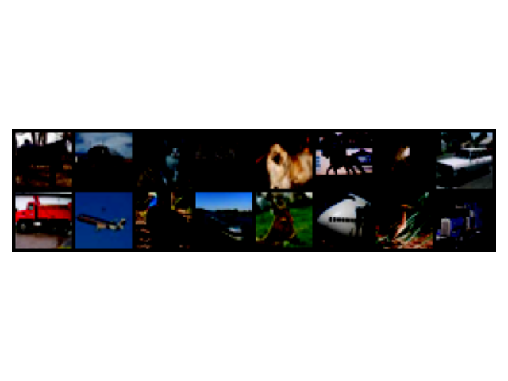
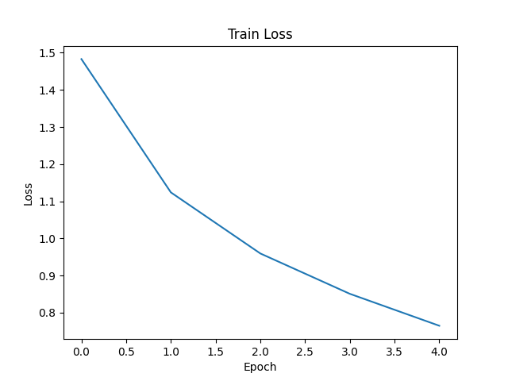
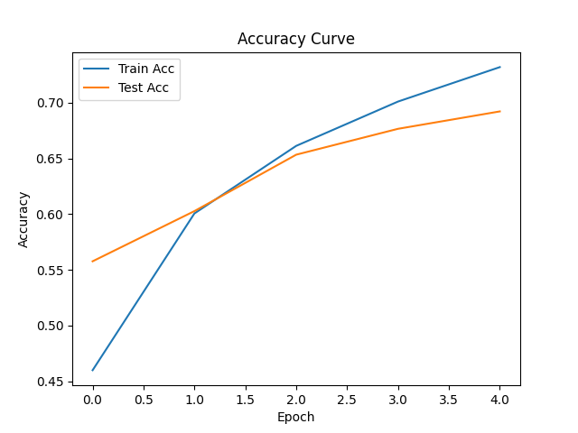

# PyTorch CIFAR-10 图像分类项目

## 📌 项目简介

本项目基于 PyTorch 实现了一个完整的图像分类训练流程，使用 CIFAR-10 数据集完成模型训练、评估与误差分析。

项目涵盖：

- 数据加载与可视化
- 模型定义与训练
- 验证与 checkpoint 保存
- 训练曲线可视化
- 实验对比分析

---

## 📂 项目结构

```text
...
```
.
├── train.py                # 训练主程序
├── evaluate.py            # 模型评估
├── models.py              # 模型定义
├── checkpoints/           # 保存最优模型
├── outputs/               # 输出结果（图片/曲线）
│   ├── samples.png
│   ├── loss_curve.png
│   └── acc_curve.png
├── experiment_report.md   # 实验报告
└── README.md              # 项目说明



