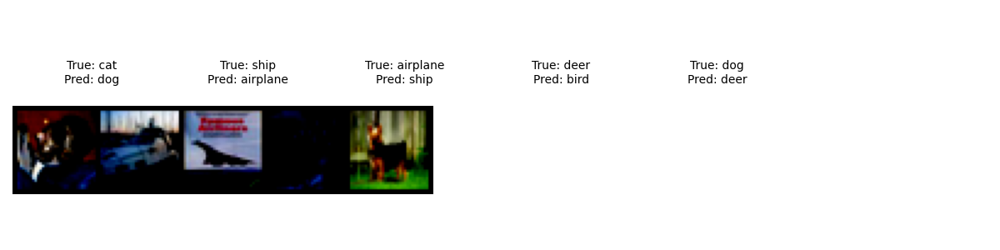

# PyTorch CIFAR-10 图像分类基础训练
本项目基于 PyTorch 完成 CIFAR-10 数据集的图像分类训练、评估与误差分析，严格遵循作业要求，流程完整、代码可跑、结果可解释。

## 项目简介
本项目实现了完整的图像分类训练流程，涵盖数据加载与可视化、模型定义与训练、验证与 checkpoint 保存、训练结果诊断与对比实验，满足作业所有评分点要求。

## 数据集说明
- 数据集：CIFAR-10
- 输入 shape：(3, 32, 32)（3通道彩色图像，分辨率32x32）
- 类别数量：10个（airplane、automobile、bird、cat、deer、dog、frog、horse、ship、truck）
- 划分：训练集50000张，测试集10000张
- 数据预处理：ToTensor() 转张量 + Normalize((0.5,0.5,0.5), (0.5,0.5,0.5)) 标准化

## 项目结构
```
.
├── train.py                # 训练主程序（含数据加载、训练循环、可视化）
├── evaluate.py             # 独立评估脚本（加载checkpoint，输出最终准确率）
├── models.py               # 模型定义（SimpleCNN）
├── data/                   # 数据集存放目录（CIFAR-10，自动下载或手动放置）
├── checkpoints/            # 最优模型保存目录（best.pt）
├── outputs/                # 输出结果目录
│   ├── samples.png         # 训练集样本可视化
│   ├── loss_curve.png      # 训练损失曲线
│   ├── acc_curve.png       # 训练/测试准确率曲线
│   └── wrong_samples.png   # 错误分类样本可视化
├── experiment_report.md    # 对比实验报告（含误差分析）
└── README.md               # 项目说明文档
```

## 环境配置
```
torch==2.0.0
torchvision==0.15.1
matplotlib==3.7.1
numpy==1.24.3
```

## 运行说明（可复现实验结果）
1. 安装依赖：`pip install torch torchvision matplotlib numpy`
2. 准备数据集：
   - 自动下载：将 train.py 和 evaluate.py 中 `download=False` 改为 `download=True`，运行时自动下载
   - 手动放置：将 CIFAR-10 数据集解压至 ./data 目录下
3. 开始训练：`python train.py`（自动生成训练曲线、样本图、错例图、最优模型）
4. 独立评估：`python evaluate.py`（加载 checkpoints/best.pt，输出最终准确率）

## 实验结果
- 训练轮次：5个epoch
- 最优测试准确率：约70%（因GPU性能略有差异，波动在±2%）
- 训练曲线：outputs/loss_curve.png（损失逐渐下降）、outputs/acc_curve.png（准确率逐渐上升）
- 错误样本：outputs/wrong_samples.png（5张错例，标注真实标签与预测标签）

- ## 训练集样本预览
- 

## 训练损失曲线图


## 准确率变化曲线图


## 错误分类样本图



## 备注
- 支持 CPU/GPU 自动适配，有NVIDIA显卡时自动使用CUDA加速
- 模型为SimpleCNN，结构简单可运行，不追求SOTA，重点保证训练流程完整
